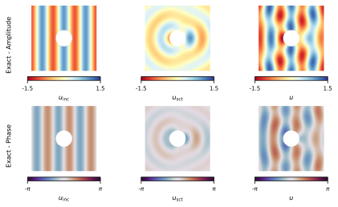
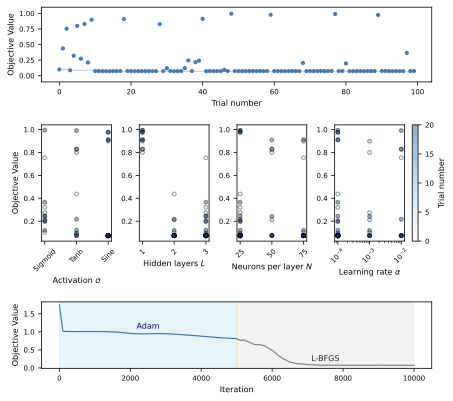
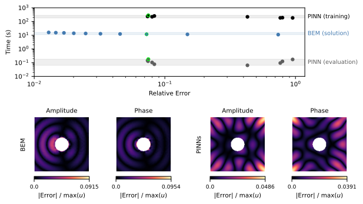
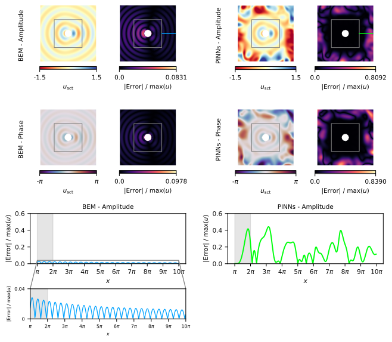

# Comparative Analysis of Wave Scattering Numerical Modeling Using the Boundary Element Method and Physics-Informed Neural Networks

This repository contains the scripts used to generate the figures presented in the paper. Our purpose is to ensure full reproducibility of the results. The structure of the repository reflects the logical flow of the paper: from analytical validation to numerical experiments and generalization tests.

## Installation or required Python packages

We recommend setting up a new Python environment with conda. You can do this by running the following commands:

```bash
conda env create -f environment.yml
conda activate comparative-pinns-bem-env
```

To verify the packages installed in your `comparative-pinns-bem-env` conda environment, you can use the following command:

```bash
conda list -n comparative-pinns-bem-env
```

## Repository Organisation

`main/`:

- `01_analytical_solution/`: Results in Figure 4. Analytical estimation of scattering.



- `02_hyperparameter_optimization/`: Results in Figure 5.



- `03_comparison/`: Results in Figure 6. Performance evaluation of BEM and PINNs.



- `04_generalization/`: Results in Figure 7. Scattered field computed by BEM and PINNs outside the training region.



## Execution times

- `01_analytical_solution/`: 8.71 s  
- `02_hyperparameter_optimization/`: 4.31 s  
- `03_comparison/`: 241.72 s  
- `04_generalization/`: 48.55 s  

**Total execution time:** 303.29 s

## How to run

To execute the full workflow (**Analytical solution → Hyperparameter tunning → Comparative analysis → Generalization**), open a terminal in the project root directory and run:

```bash
make all
```

### Run individual steps

Run the analytical solution script:

```bash
make run_analytical_solution
```

Run the hyperparameter optimization script:

```bash
make run_hyperparameter_optimization
```

Run the hyperparameter optimization results plot script:

```bash
make run_plot_optuna_results
```

Run the BEM comparison script:

```bash
make run_comparison_bem
```

Run the PINNs comparison script:

```bash
make run_comparison_pinns
```

Generate comparison plot A:

```bash
make run_comparison_plot_a
```

Generate comparison plot B:

```bash
make run_comparison_plot_b
```

Run the generalization BEM script:

```bash
make run_generalization_bem
```

Run the generalization PINNs script:

```bash
make run_generalization_pinns
```

Generate the generalization plot:

```bash
make run_generalization_plot
```

### Cleaning Up

To remove all generated figures from the figures/ folders:

```bash
make clean
```
