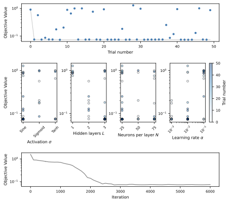

# Comparative Analysis of Wave Scattering Numerical Modeling Using the Boundary Element Method and Physics-Informed Neural Networks

This repository contains the scripts used to generate the figures presented in the paper. Our purpose is to ensure full reproducibility of the results. The structure of the repository reflects the logical flow of the paper: from analytical validation to numerical experiments and generalization tests.

[](https://arxiv.org/abs/2509.12483)

[](https://doi.org/10.5281/zenodo.18394518)


## Installation or required Python packages

We recommend setting up a new Python environment with conda. You can do this by running the following commands:

```bash
conda env create -f environment.yml
conda activate comparative-pinns-bem-env
```

To verify the packages installed in your `comparative-pinns-bem-env` conda environment, you can use the following command:

```bash
conda list -n comparative-pinns-bem-env
```

## Repository Organisation

`main/`:

- `01_analytical_solution/`: Results in analytical estimation of scattering.


- `02_hyperparameter_optimization/`: Results in hyperparameter optimization.



- `03_comparison/`: Results in performance evaluation of BEM and PINNs.


- `04_generalization/`: Results in scattered field computed by BEM and PINNs outside the training region.


## How to run

To execute the full workflow (**1. Analytical Solution → 2. Hyperparameter Optimization → 3. Comparison → 4. Generalization**), open a terminal in the project root directory and run:

```bash
make all
```

### Run individual sections

Run the Section 1 **Analytical Solution**:

```bash
make run_01_analytical_solution
```

Run the Section 2 **Hyperparameter Optimization**:
(Optuna search → training with optimized hyperparameters → plotting results):

```bash
make run_02_hyperparameter_optimization
```

Run the Section 3 **Comparison**:
(PINNs training → BEM solution evaluation → comparisons → plots):

```bash
make run_03_comparison
```

Run the Section 4 **Generalization**:
(BEM → PINNs → plots):

```bash
make run_04_generalization
```

## Execution Times

Approximated execution times of the scripts measured on GPU: NVIDIA GeForce RTX 4060 Laptop.

- `01_analytical_solution/`: ~ 1 minute
- `02_hyperparameter_optimization/`: ~ 3 hour and 38 minutes
- `03_comparison/`: ~ 6 hours and 12 minutes
- `04_generalization/`: ~ 1 minute

**Total execution time:** ~ 9 hour and 50 minutes
