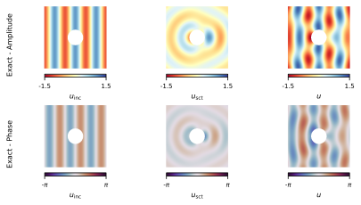

# Analytical Solution



## How to Run

To execute the analytical, open a terminal in the project directory and run:

```bash
make run_01_analytical_solution
```

## Estimated time

less than 1 minute