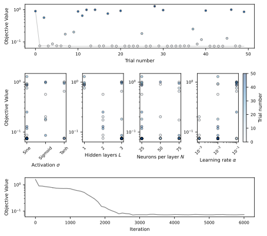

# Optuna Objective Function Minimization



## 🚀 How to Run

To execute the Optuna minimization and generate the plots, open a terminal in the project directory and run:

```bash
make all
```

Run the optimization process:

```bash
make optimize
```

Generate the optimization results plot:

```bash
make plot_optimize
