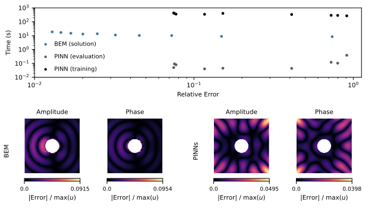

# Comparison of Accuracy and Computational Efficiency Between Methods




## 🚀 How to Run

To execute the full workflow (**Comparison → BEM → PINNs → Plots**), open a terminal in the project directory and run:

```bash
make all
```

The aproximate time required is around 15 minutes using the stored models.

Run the comparison plot a:

```bash
make run_comparison_plot_a
```

Run the BEM script:

```bash
make run_comparison_bem
```

Run the PINNs script:

```bash
make run_comparison_pinns
```

Generate the comparison plot b:

```bash
make run_comparison_plot_b
```

## Estimated time

The execution of this script takes approximately 19.28 s.