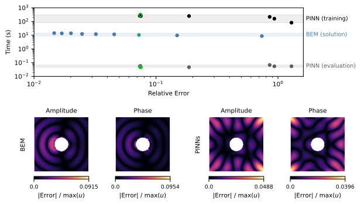

# Comparison of Accuracy and Computational Efficiency Between Methods




## How to Run

To execute the full workflow (**PINNs Training → BEM & PINNs Evaluation → Comparisons → Plots**), open a terminal in the project directory and run:

```bash
make run_03_comparison
```

## Estimated time

~ 6 hours and 12 minutes 