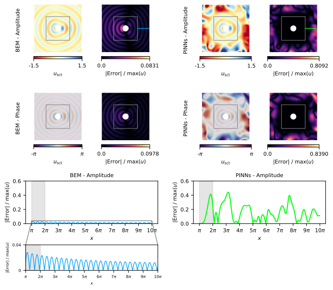

# Generalization Outside the Training Domain




## 🚀 How to Run

To execute the full workflow (**BEM → PINNs → Plot**), open a terminal in the project directory and run:

```bash
make all
```

Run the BEM script:

```bash
make run_generalization_bem
```

Run the PINNs script:

```bash
make run_generalization_pinns
```

Run the generalization plot:

```bash
make run_generalization_plot
```

## Estimated time

The execution of this script takes approximately 48.55 s.